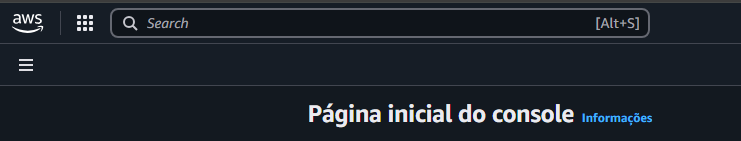

# Passo a Passo: Criando VPC, Subnets e Grupos de Segurança na AWS

## 1. Página Inicial da AWS

Ao acessar a AWS, esta é a página principal onde você pode buscar por todos os serviços.

---

## 2. Acessando o Serviço VPC

No canto superior direito, digite "VPC" para acessar o serviço de redes virtuais privadas.

---

## 3. Página da VPC

Aqui está a página inicial do serviço VPC. Clique em "Criar VPC" para iniciar a configuração.

---

## 4. Criação da VPC – Configuração do CIDR

Ao criar a VPC, insira o bloco CIDR IPv4 como `10.0.0.0/16`.  
**Por quê?**  
Esse bloco permite até 65.536 endereços IP, oferecendo flexibilidade para criar várias subnets públicas e privadas dentro da mesma VPC.

---

## 5. Criação da Subnet

Acesse a página de Subnets e clique em "Criar Sub-rede".

---

## 6. Seleção da VPC ao criar Subnet

Durante a criação da subnet, selecione a sua VPC recém-criada.

---

## 7. Configuração de Subnet

Após selecionar a VPC, configure as subnets conforme necessário.

---

## 8. Criação de Subnets em us-east-1b

Crie duas subnets na zona de disponibilidade `us-east-1b`:

- **Subnet Pública:** Bloco CIDR IPv4: `10.0.1.0/25`
- **Subnet Privada:** Bloco CIDR IPv4: `10.0.2.0/25`

**Justificativas:**
- O bloco `/25` separa cada subnet em 128 endereços IP, suficiente para recursos públicos/privados.
- Ambas devem estar na mesma zona para garantir alta disponibilidade e facilitar comunicação local.

---

## 9. Criação de Subnets em us-east-1d

Repita o processo para a zona `us-east-1d`:

- **Subnet Pública:** Bloco CIDR IPv4: `10.0.1.128/25`
- **Subnet Privada:** Bloco CIDR IPv4: `10.0.2.128/25`

**Justificativas:**
- O bloco começa em 128, não sobrepondo endereços da subnet anterior.
- Ambas na mesma zona para redundância e tolerância a falhas.

---

## 10. Criando Grupos de Segurança

Clique em "Criar grupo de segurança" para definir regras de acesso.

---

## 11. Página de Criação de Grupo de Segurança

Aqui você define nome, descrição e regras de entrada/saída.

---

## 12. Grupo de Segurança da EC2

- **Entradas:**
  - SSH (22) → Meu IP: Para garantir que apenas você possa acessar via SSH.
  - HTTP (80) → SG do Load Balancer: Permite que apenas o Load Balancer acesse via HTTP.
  - HTTP (80) → Meu IP: Para testes diretos de acesso à instância.
- **Saída:** Todo o tráfego (`0.0.0.0/0`) para permitir acesso externo.

**Justificativa:**  
Separação clara de acessos administrativos (SSH), público (HTTP via LB) e testes.

---

## 13. Grupo de Segurança do Load Balancer

- **Entrada:** HTTP (80) de qualquer lugar (`0.0.0.0/0`), pois o LB recebe o tráfego público.
- **Saída:** HTTP (80) para qualquer destino.

**Justificativa:**  
Permite que o LB atenda requisições de qualquer origem e encaminhe para as instâncias EC2.

---

## 14. Grupo de Segurança do RDS

- **Entrada:** MySQL/Aurora (3306) permitido apenas pelo SG da EC2.
- **Saída:** Todo tráfego (`0.0.0.0/0`).

**Justificativa:**  
Restringe o acesso ao banco de dados, permitindo apenas que as instâncias EC2 possam conectar.

---

## 15. Grupo de Segurança do EFS

- **Entrada:** NFS (2049) permitido apenas pelo SG da EC2.
- **Saída:** Todo tráfego (`0.0.0.0/0`).

**Justificativa:**  
Somente as instâncias EC2 podem montar o EFS, garantindo segurança ao sistema de arquivos.

