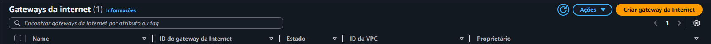
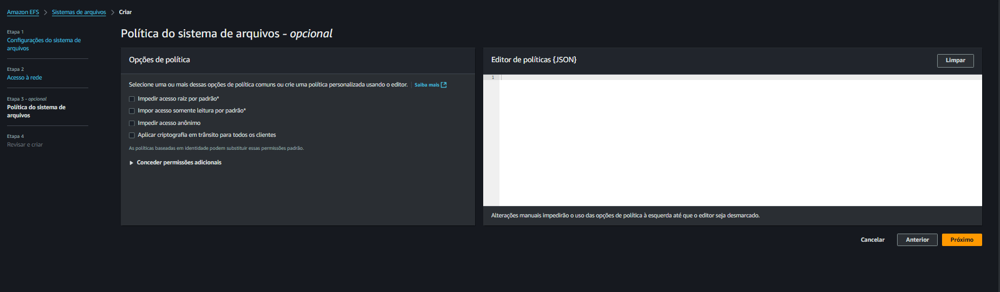
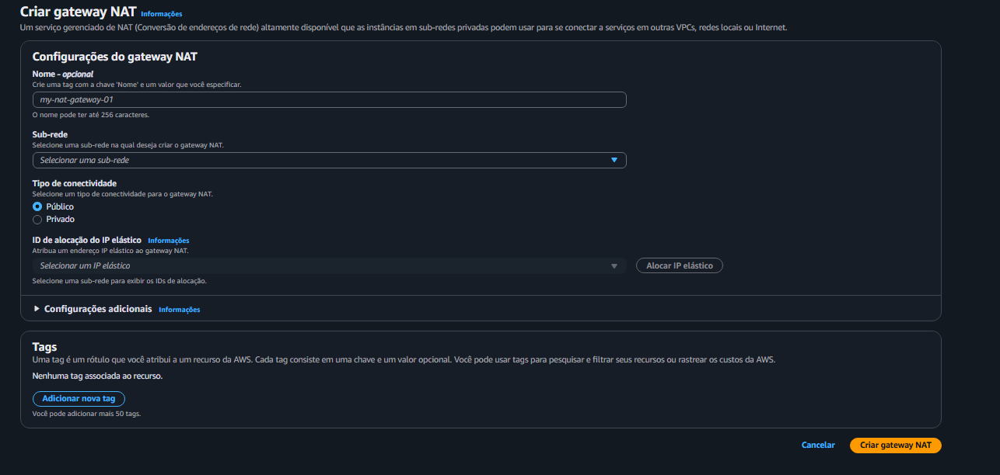
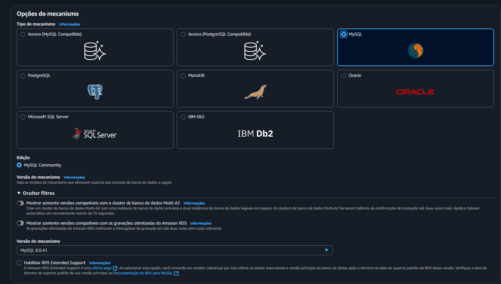
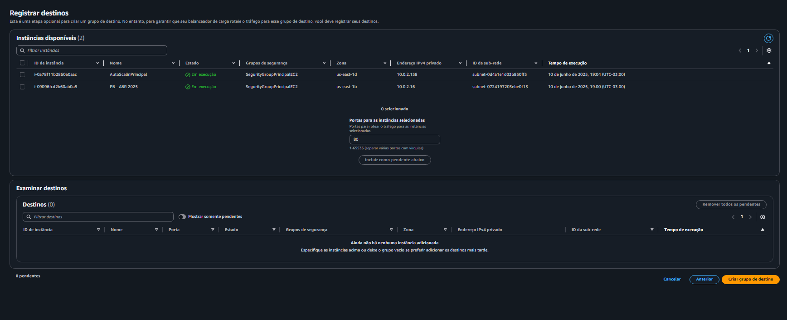

# Passo a Passo: Criando VPC, Subnets e Grupos de Segurança na AWS

## 1. Página Inicial da AWS

Ao acessar a AWS, esta é a página principal onde você pode buscar por todos os serviços.


---

## 2. Acessando o Serviço VPC

No canto superior direito, digite "VPC" para acessar o serviço de redes virtuais privadas.


---

## 3. Página da VPC

Aqui está a página inicial do serviço VPC. Clique em "Criar VPC" para iniciar a configuração.


---

## 4. Criação da VPC – Configuração do CIDR

Ao criar a VPC, insira o bloco CIDR IPv4 como `10.0.0.0/16`.  
**Por quê?**  
Esse bloco permite até 65.536 endereços IP, oferecendo flexibilidade para criar várias subnets públicas e privadas dentro da mesma VPC.


---

## 5. Criação da Subnet

Acesse a página de Subnets e clique em "Criar Sub-rede".


---

## 6. Seleção da VPC ao criar Subnet

Durante a criação da subnet, selecione a sua VPC recém-criada.


---

## 7. Configuração de Subnet

Após selecionar a VPC, configure as subnets conforme necessário.


---

## 8. Criação de Subnets em us-east-1b

Crie duas subnets na zona de disponibilidade `us-east-1b`:

- **Subnet Pública:** Bloco CIDR IPv4: `10.0.1.0/25`
- **Subnet Privada:** Bloco CIDR IPv4: `10.0.2.0/25`

**Justificativas:**
- O bloco `/25` separa cada subnet em 128 endereços IP, suficiente para recursos públicos/privados.
- Ambas devem estar na mesma zona para garantir alta disponibilidade e facilitar comunicação local.


---

## 9. Criação de Subnets em us-east-1d

Repita o processo para a zona `us-east-1d`:

- **Subnet Pública:** Bloco CIDR IPv4: `10.0.1.128/25`
- **Subnet Privada:** Bloco CIDR IPv4: `10.0.2.128/25`

**Justificativas:**
- O bloco começa em 128, não sobrepondo endereços da subnet anterior.
- Ambas na mesma zona para redundância e tolerância a falhas.


---

## 10. Criando Grupos de Segurança

Clique em "Criar grupo de segurança" para definir regras de acesso.


---

## 11. Página de Criação de Grupo de Segurança

Aqui você define nome, descrição e regras de entrada/saída.


---

## 12. Grupo de Segurança da EC2

- **Entradas:**
  - SSH (22) → Meu IP: Para garantir que apenas você possa acessar via SSH.
  - HTTP (80) → SG do Load Balancer: Permite que apenas o Load Balancer acesse via HTTP.
  - HTTP (80) → Meu IP: Para testes diretos de acesso à instância.
- **Saída:** Todo o tráfego (`0.0.0.0/0`) para permitir acesso externo.

**Justificativa:**  
Separação clara de acessos administrativos (SSH), público (HTTP via LB) e testes.


---

## 13. Grupo de Segurança do Load Balancer

- **Entrada:** HTTP (80) de qualquer lugar (`0.0.0.0/0`), pois o LB recebe o tráfego público.
- **Saída:** HTTP (80) para qualquer destino.

**Justificativa:**  
Permite que o LB atenda requisições de qualquer origem e encaminhe para as instâncias EC2.


---

## 14. Grupo de Segurança do RDS

- **Entrada:** MySQL/Aurora (3306) permitido apenas pelo SG da EC2.
- **Saída:** Todo tráfego (`0.0.0.0/0`).

**Justificativa:**  
Restringe o acesso ao banco de dados, permitindo apenas que as instâncias EC2 possam conectar.


---

## 15. Grupo de Segurança do EFS

- **Entrada:** NFS (2049) permitido apenas pelo SG da EC2.
- **Saída:** Todo tráfego (`0.0.0.0/0`).

**Justificativa:**  
Somente as instâncias EC2 podem montar o EFS, garantindo segurança ao sistema de arquivos.


---

## 16. Página da Tabela de Rotas

Aqui está a página onde você pode visualizar e gerenciar as tabelas de rotas da sua VPC. Clique em "Criar tabela de rotas" para iniciar o processo.


---

## 17. Página para Criar Tabela de Rotas

Nesta tela você define o nome, descrição e associa a tabela à sua VPC.


---

## 18. Criando Tabela de Rotas Pública

Crie uma tabela de rotas pública.  
**Por quê?**  
A tabela de rotas pública é fundamental para subnets que precisam acessar a internet diretamente. Ao associar esta tabela às subnets públicas, você poderá adicionar uma rota apontando para o Internet Gateway, permitindo que recursos nessas subnets sejam acessados pela internet (por exemplo, instâncias EC2 que precisam servir páginas web ou Load Balancers públicos).


---

## 19. Criando Tabela de Rotas Privada

Crie também uma tabela de rotas privada.  
**Por quê?**  
A tabela de rotas privada é destinada às subnets privadas, que não devem ter acesso direto à internet. Em vez disso, o tráfego de saída dessas subnets deve passar por um NAT Gateway (que está em uma subnet pública), garantindo maior segurança para recursos internos, como bancos de dados ou aplicações internas.


---

## 20. Associando Subnets Públicas à Tabela de Rotas Pública

Selecione a tabela de rotas pública e clique na aba “Associações de sub-rede”, depois em “Editar associações de sub-rede”.


---

Na página de associações da tabela pública, selecione as subnets públicas criadas anteriormente (ex: `10.0.1.0/25` e `10.0.1.128/25`).  
Assim, estas subnets terão acesso à internet conforme a rota configurada para o Internet Gateway.


---

## 21. Associando Subnets Privadas à Tabela de Rotas Privada

Agora, selecione a tabela de rotas privada, clique em “Associações de sub-rede” e em “Editar associações de sub-rede”.


---

Na página de associações da tabela privada, selecione as subnets privadas criadas (`10.0.2.0/25` e `10.0.2.128/25`).  
Dessa forma, essas subnets utilizarão o NAT Gateway para acesso à internet apenas para saída, mantendo os recursos internos protegidos de acessos externos diretos.


---

## 22. Página do Gateway de Internet

Esta é a página onde você pode visualizar e gerenciar os Internet Gateways da sua VPC. Clique em "Criar gateway de internet" para adicionar um novo gateway à sua infraestrutura.



---

## 23. Criando o Gateway de Internet

Na página de criação, defina um nome para facilitar a identificação do recurso.

**Por que criar um Internet Gateway?**  
O Internet Gateway é o componente responsável por permitir que recursos em subnets públicas da sua VPC se comuniquem com a internet. Ele serve como a porta de entrada e saída do tráfego externo, sendo fundamental para instâncias EC2 públicas, Load Balancers e outros serviços que precisam ser acessados a partir da internet.


---

## 24. Por que criar um EFS?

O Amazon EFS (Elastic File System) permite que várias instâncias EC2 compartilhem o mesmo sistema de arquivos simultaneamente, sendo ideal para aplicações como o WordPress, onde é necessário persistir arquivos (uploads, plugins, temas) entre múltiplas instâncias em um ambiente escalável.

---

## 25. Página Principal do EFS

Esta é a página inicial do serviço EFS, onde você pode visualizar e criar sistemas de arquivos.


---

## 26. Criando um novo EFS

Clique em “Criar sistema de arquivos”, defina o nome, selecione sua VPC e clique em “Personalizar”.


---

## 27. Etapa 1 – Configurações Gerais

- **Regional:** O EFS é um serviço regional, garantindo alta disponibilidade entre zonas na mesma região.
- **Backup automático:** Não habilitar nesta etapa, pois para ambientes de teste ou controle de custos, backups automáticos podem ser desnecessários.
- **Gerenciamento de ciclo de vida:** Não habilite, ou defina como “Intermitente”, para ambientes com uso variável.
- **Performance:** Escolha “Uso geral” para garantir baixa latência em aplicações web como o WordPress.
- **Tag:** Adicione uma tag com seu nome para facilitar a identificação e controle do recurso.


---

## 28. Etapa 2 – Rede

Selecione a VPC correta e altere os grupos de segurança para utilizar o grupo de segurança do EFS que você criou anteriormente. Isso garante que apenas as instâncias EC2 autorizadas possam montar o EFS.


---

## 29. Etapa 3 – Configurações Avançadas

Nesta etapa, apenas clique em “Next” para prosseguir, pois as configurações padrão normalmente já atendem ao cenário.



---

## 30. Etapa 4 – Criar o EFS

Revise as configurações e clique em “Criar sistema de arquivos”.


---

## 31. Aguardando a Criação

Aguarde até que o status do EFS mude para “Disponível” para começar a utilizá-lo.


---

## 32. Por que criar um NAT Gateway?

O NAT Gateway (Network Address Translation) é essencial para que recursos em subnets privadas (como instâncias EC2, bancos de dados ou containers) possam acessar a internet para baixar atualizações e pacotes, sem ficarem expostos a acessos externos. Ele garante que o tráfego de saída dessas instâncias passe pelo NAT, mantendo a segurança da arquitetura.


---

## 33. Página do NAT Gateway

Esta é a página onde você pode visualizar e gerenciar os NAT Gateways da sua VPC. Clique em “Criar NAT gateway” para iniciar o processo.



---

## 34. Página de Criação do NAT Gateway

Na tela de criação, preencha os seguintes campos:

- **Nome:** Escolha um nome para identificar facilmente o NAT Gateway.
- **Subnet:** Selecione a sua subnet pública principal (por exemplo, “publica01”). O NAT Gateway precisa estar em uma subnet pública para acessar a internet.
- **Tipo de conectividade:** Deixe como “Pública” para garantir acesso externo.
- **IP elástico:** Clique em “Alocar novo IP elástico”. Isso garante que o NAT Gateway terá um endereço IP público fixo, necessário para comunicação com a internet.
- Por fim, clique em “Criar NAT gateway”.


---

## 35. Página Principal do RDS

Esta é a página inicial do serviço Amazon RDS, onde você pode criar e gerenciar bancos de dados relacionais.


---

## 36. Escolha do MySQL e Versão

Selecione o mecanismo MySQL, pois o WordPress é otimizado para funcionar com MySQL.  
Escolha sempre a versão mais recente disponível para garantir mais segurança, desempenho e compatibilidade com plugins modernos.



---

## 37. Modelo de Uso: Nível Gratuito

Na etapa de modelo, escolha o “Nível gratuito” para aproveitar os benefícios da camada gratuita da AWS.  
**Por quê?**  
O nível gratuito permite testar e aprender sem custos adicionais, sendo perfeito para ambientes de estudo e desenvolvimento.


---

## 38. Configuração do Banco de Dados

Defina um identificador para o banco (ex: `wordpress-db`), um nome de usuário (“admin”, por exemplo) e uma senha forte.  
**Por quê?**  
Essas credenciais serão usadas pelo WordPress para conectar ao banco de dados, então devem ser seguras e facilmente identificáveis no seu ambiente.


---

## 39. Configuração da Instância

Escolha a classe de instância `db.t3.micro`.  
**Por quê?**  
Esse tipo de instância é elegível ao nível gratuito e está disponível para contas novas ou de teste, sendo suficiente para ambientes de aprendizado ou baixo volume de acessos.


---

## 40. Configuração de Rede e VPC

- **VPC:** Selecione a VPC que você criou anteriormente para isolar o ambiente.
- **Grupo de sub-redes:** Escolha o grupo de sub-redes (privadas) criado especialmente para o RDS, garantindo que o banco não fique exposto à internet.
- **Grupo de segurança:** Selecione o grupo de segurança do RDS, permitindo acesso apenas das instâncias EC2 (backend do WordPress).

**Por quê?**  
Assim, o banco de dados fica protegido em subnets privadas, acessível apenas pelas instâncias EC2 autorizadas.


---

## 41. Configurações Adicionais

Mais abaixo, em "Configurações adicionais", defina o nome do banco de dados (por exemplo, `wordpress`).  
Isso facilita a configuração do WordPress posteriormente, pois saberá exatamente o nome do banco a ser utilizado.


---

## 42. Visualizando o Banco Criado

Após a criação, você poderá visualizar e monitorar o banco de dados na tela inicial do RDS.


**Resumo dos passos:**  
Essas configurações garantem que todas as instâncias nas subnets privadas possam acessar a internet de forma segura e controlada, sem ficarem expostas diretamente a acessos externos.

---

# Passo a Passo: Criando e Configurando a Instância EC2 para WordPress

## 42. O que é a EC2?

A Amazon EC2 (Elastic Compute Cloud) é o serviço de máquinas virtuais (instâncias) da AWS. Ela permite criar servidores sob demanda, com diferentes sistemas operacionais, tamanhos e configurações, para rodar aplicações como o WordPress.

---

## 43. Página Principal da EC2

Esta é a página inicial do serviço EC2. Clique em “Executar instância” para criar uma nova máquina virtual.


---

## 44. Nome e Tags; Imagem da Aplicação

- **Nome e Tags:** Insira um nome e as tags exigidas pela sua conta. Tags são essenciais para organização, controle de custos e políticas automáticas. Sem as tags obrigatórias, a criação pode falhar.
- **Imagem da Aplicação:** Escolha a AMI (imagem de sistema operacional) de sua preferência. Neste exemplo, usamos o Ubuntu, pois é estável, popular e amplamente suportado.


---

## 45. Tipo de Instância e Par de Chaves

- **Tipo de Instância:** Selecione “t2.micro”, elegível ao nível gratuito da AWS, ideal para testes e ambientes pequenos.
- **Par de Chaves:** Um par de chaves SSH é necessário para acessar a instância com segurança. Se já possui um, selecione-o; se não, clique para criar um novo. Baixe e guarde o arquivo `.pem` com segurança!


---

## 46. Configuração de Rede

Clique em “Editar” para configurar rede e segurança.


---

- **VPC:** Selecione a VPC que criamos anteriormente, garantindo isolamento e controle de tráfego.
- **Sub-rede:** Escolha a subnet privada 01 (ex: `10.0.2.0/25`), garantindo que a instância não seja exposta à internet.
- **Atribuição de IP público:** Desabilite, pois a instância está na subnet privada.
- **Grupo de Segurança:** Selecione o grupo de segurança EC2 definido por você, permitindo apenas os acessos necessários.


---

## 47. Pegando o Endpoint do Banco de Dados e DNS da EFS

- **Endpoint do RDS:** Após criar o banco de dados, obtenha o endpoint (endereço DNS) na página de detalhes do RDS. Ele será usado pelo WordPress para se conectar ao banco.
  
- **DNS da EFS:** Pegue o DNS do EFS na tela de detalhes do sistema de arquivos EFS. Ele será necessário para montar o volume compartilhado nas instâncias EC2.
  

---

## 48. User Data – Script de Inicialização Automática

No campo “User data”, adicione o script abaixo. Ele prepara o ambiente, instala Docker, MySQL client e NFS, monta o EFS, cria o banco WordPress se não existir, e inicia o contêiner WordPress apontando para o banco e o EFS:

```bash
#!/bin/bash
apt-get update -y
apt-get install -y docker.io mysql-client nfs-common
systemctl start docker
systemctl enable docker
mkdir -p /mnt/efs
mount -t nfs4 -o nfsvers=4.1 fs-0070a0c9ca7341265.efs.us-east-1.amazonaws.com:/ /mnt/efs
docker pull wordpress:latest
sleep 15
DB_HOST="bancoprincipal.ce3yu8ycol1v.us-east-1.rds.amazonaws.com"
DB_USER="admin"
DB_PASS="admin1234"
DB_NAME="bancoPrincipal"
mysql -h $DB_HOST -u $DB_USER -p$DB_PASS -e "CREATE DATABASE IF NOT EXISTS $DB_NAME;"
docker rm -f wordpress || true
docker run -d --name wordpress \
  -p 80:80 \
  -e WORDPRESS_DB_HOST=$DB_HOST:3306 \
  -e WORDPRESS_DB_USER=$DB_USER \
  -e WORDPRESS_DB_PASSWORD=$DB_PASS \
  -e WORDPRESS_DB_NAME=$DB_NAME \
  -v /mnt/efs:/var/www/html/wp-content/uploads \
  wordpress:latest
```

### Explicação Completa do Script

- Atualiza o sistema e instala Docker, cliente MySQL e utilitário NFS.
- Inicia e habilita o Docker para inicialização automática.
- Cria o diretório para montar o EFS.
- Monta o EFS usando o DNS do serviço.
- Baixa a imagem mais recente do WordPress.
- Aguarda 15 segundos para garantir que tudo esteja pronto.
- Define variáveis de ambiente do banco de dados.
- Cria o banco de dados caso ainda não exista.
- Remove contêiner WordPress anterior, se houver.
- Sobe um novo contêiner WordPress, conectando ao RDS e montando o EFS para uploads compartilhados.

---

#### **Linha a linha do User Data:**

1. `apt-get update -y`
   - Atualiza a lista de pacotes do sistema para garantir que as instalações sejam feitas com as últimas versões disponíveis.

2. `apt-get install -y docker.io mysql-client nfs-common`
   - Instala três pacotes:
     - **docker.io:** Permite rodar containers Docker (como o WordPress).
     - **mysql-client:** Cliente MySQL para interagir com o banco RDS.
     - **nfs-common:** Utilitário para montar volumes NFS, necessário para o EFS.

3. `systemctl start docker`
   - Inicia o serviço Docker.

4. `systemctl enable docker`
   - Configura o Docker para iniciar automaticamente junto com o sistema.

5. `mkdir -p /mnt/efs`
   - Cria o diretório onde o EFS será montado.

6. `mount -t nfs4 -o nfsvers=4.1 fs-0070a0c9ca7341265.efs.us-east-1.amazonaws.com:/ /mnt/efs`
   - Monta o EFS usando NFS v4.1 no diretório criado, utilizando o DNS próprio do seu EFS.

7. `docker pull wordpress:latest`
   - Baixa a imagem mais atual do WordPress no Docker Hub.

8. `sleep 15`
   - Aguarda 15 segundos para garantir que todos os serviços estejam prontos antes de continuar.

9. 
   ```bash
   DB_HOST="bancoprincipal.ce3yu8ycol1v.us-east-1.rds.amazonaws.com"
   DB_USER="admin"
   DB_PASS="admin1234"
   DB_NAME="bancoPrincipal"
   ```
   - Define as variáveis de ambiente para acesso ao banco de dados RDS.

10. `mysql -h $DB_HOST -u $DB_USER -p$DB_PASS -e "CREATE DATABASE IF NOT EXISTS $DB_NAME;"`
    - Usa o cliente MySQL para criar o banco de dados no RDS, caso ele ainda não exista.

11. `docker rm -f wordpress || true`
    - Remove (força) qualquer container chamado "wordpress" que já esteja rodando, para evitar conflitos ao subir o novo container. O `|| true` garante que o script continua mesmo se não houver container rodando.

12. 
    ```bash
    docker run -d --name wordpress \
      -p 80:80 \
      -e WORDPRESS_DB_HOST=$DB_HOST:3306 \
      -e WORDPRESS_DB_USER=$DB_USER \
      -e WORDPRESS_DB_PASSWORD=$DB_PASS \
      -e WORDPRESS_DB_NAME=$DB_NAME \
      -v /mnt/efs:/var/www/html/wp-content/uploads \
      wordpress:latest
    ```
    - Sobe o container WordPress em modo destacado (`-d`), expondo a porta 80, passando as variáveis de configuração do banco e montando o EFS na pasta de uploads. Assim, arquivos enviados pelo WordPress ficam persistentes e compartilhados entre instâncias.

---


## 49. Instância EC2 Criada

Após a execução, você verá sua instância EC2 criada e pronta para uso, rodando o WordPress conforme as configurações acima.


---

# Passo a Passo: Criando um Grupo de Auto Scaling na AWS

## 50. O que é o Auto Scaling?

O **Auto Scaling** é um serviço da AWS que ajusta automaticamente a quantidade de instâncias EC2 em seu ambiente de acordo com a demanda (carga de trabalho). Ele ajuda a garantir alta disponibilidade, desempenho e otimização de custos, aumentando ou diminuindo o número de servidores conforme necessário sem intervenção manual.

---

## 51. Página Principal do Auto Scaling

Aqui está a página inicial do Auto Scaling. Clique em **“Criar grupo de Auto Scaling”** para iniciar a configuração.


---

## 52. Etapa 1 – Nome e Modelo de Execução

- **Nome:** Defina um nome para identificar seu grupo de Auto Scaling.
- **Modelo de Execução:** Escolha um modelo de execução existente ou crie um novo, que irá definir a configuração das instâncias a serem lançadas.


---

## 53. Criando o Modelo de Execução

Se não tiver um modelo pronto, clique para criar um novo:

- **Nome e Descrição:** Defina um nome e uma descrição para o template.
- **AMI (Imagem):** Selecione a mesma AMI utilizada na criação da EC2 (neste caso, Ubuntu), garantindo compatibilidade de configuração.


  
- **Tipo de Instância:** Selecione `t2.micro`, elegível ao nível gratuito, ideal para testes e custos reduzidos.
- **Par de Chaves:** Escolha o par de chaves SSH que você criou para acessar as máquinas.
- **Sub-rede:** Selecione a subnet privada 02 criada anteriormente.
- **Grupo de Segurança:** Escolha o grupo de segurança utilizado para o Load Balancer, permitindo o tráfego necessário para o balanceamento.

 

- **Tags de Recurso:** Adicione as mesmas tags usadas na EC2. Tags são fundamentais para controle, automação e políticas internas da conta.

 
-
- **User Data:** Coloque o mesmo script de user data utilizado na EC2. Isso garante que toda instância criada pelo Auto Scaling já suba pronta para rodar o WordPress, montar o EFS e conectar ao banco.
  


---

## 54. Etapa 2 – Rede e Subnets

- **VPC:** Escolha a VPC criada anteriormente para isolar seu ambiente.
- **Subnets:** Selecione as duas subnets privadas que você criou (ex: `10.0.2.0/25` e `10.0.2.128/25`). Isso garante alta disponibilidade entre zonas de disponibilidade.


---

## 55. Etapa 3 – Balanceador de Carga

- **Anexar a um Balanceador de Carga Existente:** Selecione esta opção para que suas instâncias sejam automaticamente registradas em um Load Balancer.
- **Grupo de Destino:** Escolha o grupo de destino do Load Balancer que você irá criar (ou já criou). Isso garante que o tráfego externo seja distribuído entre as instâncias do Auto Scaling.


---

## 56. Etapa 4 – Capacidade e Políticas

- **Capacidade Desejada:** 1 (quantidade inicial de instâncias).
- **Capacidade Mínima:** 1 (garante que sempre haverá pelo menos uma instância rodando).
- **Capacidade Máxima:** 2 (limita o crescimento automático para dois servidores, ideal para ambientes de teste).
- **Política de Dimensionamento:** Escolha o monitoramento por objetivo. Isso permite que o Auto Scaling monitore métricas como CPU e ajuste o número de instâncias automaticamente.


---

## 57. Etapa 5 – Notificações

- **Notificações:** Esta etapa é opcional. Você pode configurar notificações via email ou SNS para ser avisado sobre mudanças no grupo de Auto Scaling.


---

## 58. Etapa 6 – Etiqueta

- **Etiqueta:** Coloque o nome que você definiu na etapa 1 para facilitar a identificação do seu grupo.


---

## 59. Revisar e Criar

Revise todas as configurações e clique em **“Criar grupo de Auto Scaling”**.


---

## 60. Verificando o Grupo de Auto Scaling

Após a criação, você poderá ver e gerenciar seu grupo de Auto Scaling na tela principal.


---

# Passo a Passo: Criando um Grupo de Destino para o Load Balancer

## 61. O que é um Grupo de Destino?

O **Grupo de Destino** (Target Group) é um recurso do Load Balancer da AWS que define para onde o tráfego deve ser encaminhado. Ele agrupa as instâncias EC2 (ou outros recursos) que irão receber o tráfego balanceado. Assim, o Load Balancer pode monitorar a saúde das instâncias e distribuir requisições apenas para aquelas que estão saudáveis.

---

## 62. Página Principal do Grupo de Destino

Esta é a tela inicial de grupos de destino. Clique em **“Criar grupo de destino”** para começar.


---

## 63. Etapa 1 – Configurações Iniciais

- **Tipo de destino:** Selecione “Instância”. Assim, o tráfego do Load Balancer será enviado diretamente para as instâncias EC2.
- **Demais opções:** Deixe as opções padrão, pois elas já atendem à maioria dos cenários de aplicações web.


---

- **VPC:** Escolha a VPC que você criou para o projeto, garantindo isolamento e roteamento correto.
- **Verificação de integridade (Health Check Path):**  
  - **Caminho:** Defina o caminho para verificação, por exemplo `/healthcheck` (é uma boa prática para saber se a aplicação está rodando).
  - **Limite íntegro:** 2 (quantas respostas consecutivas de sucesso para considerar íntegro).
  - **Limite não íntegro:** 2 (quantas falhas para considerar a instância não íntegra).
  - **Tempo limite:** 5 segundos (após esse tempo, uma verificação é considerada falha).
  - **Intervalo:** 15 segundos (tempo entre cada verificação).
  
Esses parâmetros permitem detecção rápida e precisa de instâncias saudáveis, encaminhando o tráfego apenas para quem realmente está funcionando.


---

## 64. Etapa 2 – Instâncias

Nesta etapa, você verá as instâncias EC2 disponíveis. Não é necessário selecionar manualmente agora, pois o Auto Scaling irá registrar/desregistrar instâncias automaticamente conforme necessário.

Clique em **“Criar grupo de destino”** para finalizar.



---

## 65. Grupo de Destino Criado

Após a criação, você poderá visualizar o grupo de destino na tela principal. Ele estará pronto para ser associado ao Load Balancer e ao Auto Scaling.


---
